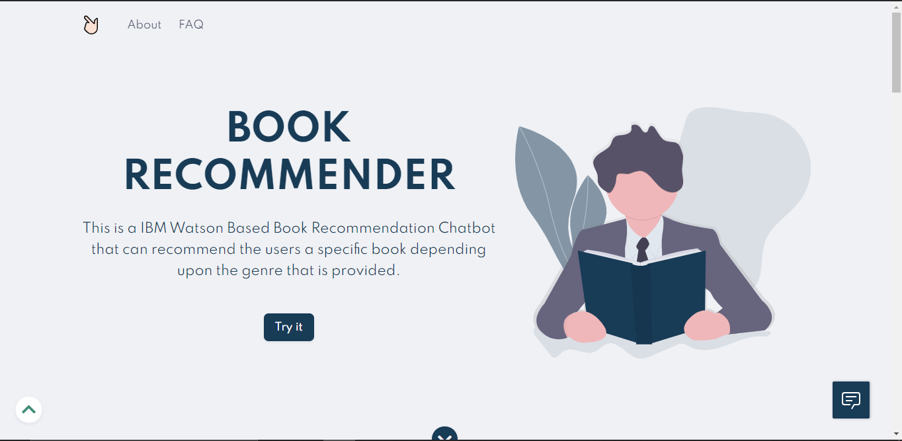
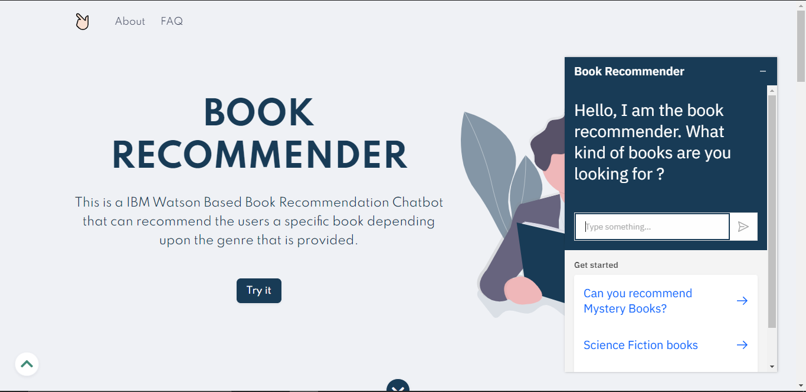

# IBM-Book-Recommender-Chatbot

An Intelligent Bot that recommends you some of the great books handpicked by us. The Bot is bootstrapped with **IBM Watson Assistant**. The bot can recommend various genres of books like Horror, Mystery, Thriller, Fiction types - Science Fiction, Historical, Fantasy, Realistic Fiction, Kids Books and many more. It can even detect vague replies and reply accordingly. It has conditional jumps also configured for better user experience.

> View live at: [Book Recommender Chatbot](https://book-recommender-chatbot.herokuapp.com)

## Screenshots

1] Home Screen 

    

2] Chat-Bot

  

## Developed By

- [Smit Shah](https://github.com/smit-sms)
- [Chintan Vora](https://github.com/cvora51)
- [Divyesh Sapariya](https://github.com/DiviSp)

## License
[MIT](https://github.com/smit-sms/IBM-Book-Recommender-Chatbot/blob/main/LICENSE)
